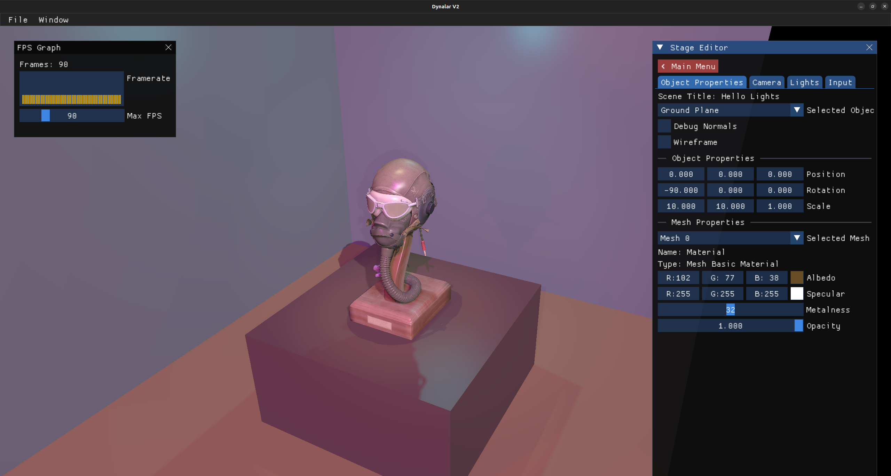

# Dynalar Rendering Engine

A sandbox rendering engine written in C++ and OpenGL.



- [Dynalar Rendering Engine](#dynalar-rendering-engine)
- [Setup](#setup)
  - [Linux](#linux)
  - [Apple](#apple)
- [Important Links](#important-links)
- [FAQ](#faq)
- [TODO](#todo)

# Setup

## Linux

Make sure `cmake` and `GCC` are installed. We are using `GDB` debugger.

```bash
sudo apt update
sudo apt install cmake build-essential gdb g++
```

Vcpkg is used to manage dependencies. [Install](https://vcpkg.io/en/getting-started) it and install the dependencies. We are using manifest mode and thus the dependencies are already listed in the `vcpkg.json` file. To install the dependencies, run the following command:

```bash
vcpkg install
```

alternatively, you can also just use the [Vcpkg extension](https://marketplace.visualstudio.com/items?itemName=JackBoosY.vcpkg-cmake-tools) in VSCode. It will automatically install the dependencies.

Other than the packages vckpg suggests to install, the following would also be needed (on Linux):

```bash
sudo apt install libglfw3-dev libxinerama-dev libxcursor-dev xorg-dev libglu1-mesa-dev pkg-config
```

## Apple

Same as above. You may need to install the following before running `vcpkg install`:

```bash
brew install pkg-config
```

# Important Links

1. https://code.visualstudio.com/docs/languages/cpp
2. https://learn.microsoft.com/en-us/vcpkg/users/buildsystems/cmake-integration
3. https://github.com/KhronosGroup/glTF-Sample-Assets

# FAQ

- Q. CMakeLists.txt throws some errors.
  - A. Start by deleting the `build` folder and try again.
- Q. Vcpkg installed libs throwing error in Cmake, looking for config.
  - Make sure to set the correct triplet for the vcpkg in settings.json. For example, `-DVCPKG_TARGET_TRIPLET=x64-linux`
- Q. How to check OpenGL version supported by Nvidia GPU?
  - A. `glxinfo | grep "OpenGL version"` or `glxinfo | grep OpenGL`

# TODO

- [ ] Cross platform scaling
  - [ ] DPI & Scaling
- [ ] Remove VCPKG extension and use directly in CMake
- [ ] Figure out how to add new cpp files correctly without needing to delete the build folder.
- [ ] Lift mouse settings on app level instead of per-scene level
- [ ] Scene Graph
- [ ] Find optimised way of doing transforms
